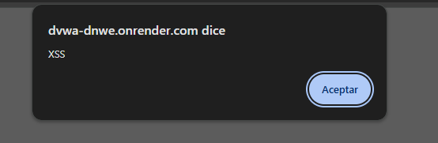

# 3. Cross-Site Scripting (XSS)

## 3.1 Descripción de la Vulnerabilidad

**Cross-Site Scripting (XSS)** es una vulnerabilidad de aplicaciones web que permite a un atacante inyectar código ejecutable, generalmente JavaScript, dentro de páginas web visualizadas por otros usuarios.

Esta vulnerabilidad ocurre cuando una aplicación incorpora datos proporcionados por el usuario en la respuesta HTML sin realizar una validación o sanitización adecuada. Como resultado, el navegador interpreta el contenido malicioso como código legítimo y lo ejecuta dentro del contexto del sitio web.

XSS es una de las vulnerabilidades más comunes en aplicaciones web y se encuentra incluida dentro de las principales categorías de riesgo identificadas por OWASP.

En el contexto específico de una organización Fintech como **PagaFácil**, las consecuencias de una vulnerabilidad XSS Reflejada se extienden mucho más allá de un vector estético o una alerta emergente en pantalla. 

Al ejecutarse el código de manera arbitraria en el navegador del cliente, un atacante sofisticado puede comprometer directamente la sesión activa mediante la exfiltración de tokens de autenticación o el secuestro de cookies que no posean atributos de protección avanzados. Asimismo, mediante la manipulación dinámica del DOM (Document Object Model), el atacante es capaz de alterar visualmente la interfaz de la billetera digital en tiempo real; esto permite redirigir transferencias electrónicas a cuentas de terceros, modificar montos de transacciones sin el consentimiento del usuario y suplantar formularios de pago para capturar credenciales críticas (Phishing localizado), destruyendo la confianza depositada en la plataforma financiera.

---

## 3.2 Evidencia de la Vulnerabilidad

Durante la auditoría se evaluó el módulo vulnerable de Cross-Site Scripting disponible en DVWA.

Se ingresó el siguiente payload de prueba:

```html id="px1x6u"
<script>alert('XSS')</script>
```

El objetivo del payload es verificar si la aplicación interpreta y ejecuta código JavaScript enviado por el usuario.

### Evidencia 1 – Ejecución de Código JavaScript



**Figura 2.** Ejecución exitosa de un ataque Cross-Site Scripting (XSS). La aplicación procesa el código JavaScript inyectado y el navegador muestra una ventana emergente con el mensaje "XSS", demostrando que el script fue ejecutado correctamente.

### Resultado Obtenido

La aplicación generó una ventana emergente con las siguientes características:

| Elemento          | Valor                  |
| ----------------- | ---------------------- |
| Origen            | dvwa-dnwe.onrender.com |
| Mensaje mostrado  | XSS                    |
| Acción disponible | Aceptar                |

La aparición de esta alerta confirma que el navegador ejecutó el código JavaScript inyectado por el usuario.

---

## 3.3 Explicación Técnica del Ataque

Una aplicación vulnerable puede incorporar directamente los datos ingresados por el usuario dentro del código HTML generado.

Por ejemplo:

```html id="5ehfja"
<p>Bienvenido, NOMBRE_USUARIO</p>
```

Si el usuario introduce:

```html id="r6s3di"
<script>alert('XSS')</script>
```

La aplicación podría generar la siguiente respuesta:

```html id="xwot29"
<p>Bienvenido,
<script>alert('XSS')</script>
</p>
```

Cuando el navegador interpreta esta respuesta, detecta la etiqueta `<script>` y ejecuta el código JavaScript contenido en ella.

En este caso se utilizó una función simple (`alert()`) con fines demostrativos. Sin embargo, un atacante real podría ejecutar scripts mucho más peligrosos para capturar información sensible o manipular la interacción del usuario con el sistema.

---

## 3.4 Análisis de Funcionamiento

La explotación fue posible debido a que la aplicación presenta varias deficiencias de seguridad.

### Falta de Sanitización de Salidas

La aplicación devuelve información proporcionada por el usuario sin eliminar etiquetas HTML o código JavaScript potencialmente peligroso.

### Validación Insuficiente de Entradas

No existen controles adecuados para detectar y bloquear contenido activo como scripts.

### Confianza Excesiva en el Navegador

La aplicación asume que los datos recibidos son seguros y los envía directamente al navegador para su procesamiento.

### Ausencia de Políticas de Seguridad

No se observan mecanismos que restrinjan la ejecución de scripts potencialmente peligrosos dentro de la aplicación.

Estas condiciones permiten que código arbitrario sea ejecutado en el navegador de los usuarios.

---

## 3.5 Impacto sobre Usuarios y Activos de Información

Aunque el ejemplo mostrado utiliza una ventana emergente inofensiva, una explotación real podría generar consecuencias significativas para PagaFácil.

### Credenciales de Usuarios

Un atacante podría crear formularios falsos para capturar nombres de usuario y contraseñas.

### Cookies de Sesión

Las sesiones autenticadas podrían ser robadas y utilizadas para acceder a cuentas legítimas.

### Información Financiera

Los usuarios podrían visualizar información manipulada o ser redirigidos a sitios fraudulentos.

### Historial de Transacciones

La información mostrada al usuario podría ser alterada para ocultar operaciones o engañar a las víctimas.

### Reputación Corporativa

La explotación exitosa de XSS puede afectar la confianza de los clientes en la plataforma financiera.

---

## 3.6 Evaluación del Riesgo (CVSS v3.1)

Para determinar la severidad técnica de la vulnerabilidad Cross-Site Scripting (XSS Reflejado) de manera objetiva, se aplicó el estándar internacional **CVSS v3.1** (Common Vulnerability Scoring System).

**Vector de Ataque Oficial:** `CVSS:3.1/AV:N/AC:L/PR:N/UI:R/S:C/C:L/I:L/A:N`
**Puntaje Base Global:** 6.1 (Medio)

### Desglose de Métricas del Vector Base

| Métrica CVSS v3.1 | Componente Técnico | Valor Asignado | Impacto / Significado |
| :--- | :--- | :--- | :--- |
| **AV** (Attack Vector) | Vector de Ataque | **N** (Network) | Explotable de forma remota a través de HTTP/HTTPS. |
| **AC** (Attack Complexity) | Complejidad del Ataque | **L** (Low) | Baja; no existen mecanismos de protección (WAF/filtros). |
| **PR** (Privileges Required) | Privilegios Requeridos | **N** (None) | No requiere autenticación previa ni roles en el portal. |
| **UI** (User Interaction) | Interacción del Usuario | **R** (Required) | Requiere que la víctima haga clic en el enlace inyectado. |
| **S** (Scope) | Alcance | **C** (Changed) | **Cambia**; el script salta del servidor al navegador web. |
| **C** (Confidentiality) | Confidencialidad | **L** (Low) | Permite la lectura local de datos y secuestro de sesiones. |
| **I** (Integrity) | Integridad | **L** (Low) | Permite alteración visual del DOM y suplantación de forms. |
| **A** (Availability) | Disponibilidad | **N** (None) | Nulo; la ejecución ocurre aislada en el cliente. |

### Justificación Detallada de las Métricas del Vector

Con el fin de asegurar la máxima rigurosidad en la auditoría de PagaFácil, se argumenta técnicamente la selección de cada componente:

* **Vector de Ataque (AV:N - Network):** El ataque se propaga de forma remota a través de la red empleando el protocolo HTTP/HTTPS. El atacante inyecta el script malicioso a través de parámetros URL o campos de formularios web, sin requerir acceso físico o local a la infraestructura del servidor.
* **Complejidad del Ataque (AC:L - Low):** La complejidad es baja debido a que la aplicación web (DVWA en nivel Low) no implementa cabeceras de seguridad, filtros de saneamiento, ni reglas de inspección perimetral (WAF) que bloqueen etiquetas HTML o sentencias ejecutables de JavaScript.
* **Privilegios Requeridos (PR:N - None):** No se requiere que el atacante posea una cuenta autenticada ni privilegios previos en el portal web para explotar la falla. El vector de XSS Reflejado puede ser enviado a cualquier usuario de internet de forma abierta.
* **Interacción del Usuario (UI:R - Required):** A diferencia de las inyecciones SQL, el XSS Reflejado **requiere obligatoriamente la interacción de una víctima**. El atacante debe inducir al usuario legítimo de PagaFácil a realizar una acción, típicamente hacer clic en un enlace malicioso hipervinculado o un vector de phishing que gatille la carga del parámetro vulnerado.
* **Alcance (S:C - Changed):** El alcance **Cambia (Changed)** debido a que la ejecución exitosa del script malicioso vulnera el entorno de Sandbox del navegador web de la víctima. El atacante logra ejecutar código arbitrario dentro del contexto de ejecución del cliente, un entorno de seguridad distinto y ajeno al software del servidor web que aloja la aplicación.
* **Confidencialidad (C:L - Low):** El impacto se evalúa como bajo en el servidor, pero crítico para el cliente afectado. El script inyectado permite al atacante acceder y leer datos locales del navegador de la víctima (como propiedades del DOM o tokens de sesión no protegidos), lo que en el escenario de PagaFácil facilita el secuestro de la sesión activa del cliente.
* **Integridad (I:L - Low):** El impacto es bajo para el sistema central, pero afecta la integridad visual de la sesión de la víctima. Un atacante puede manipular dinámicamente el HTML mediante el DOM (DOM Manipulation), alterando los montos, los formularios de transferencia o suplantando la identidad visual del portal financiero para capturar credenciales mediante phishing localizado.
* **Disponibilidad (A:N - None):** La explotación del XSS Reflejado no consume recursos de infraestructura del servidor web ni degrada los servicios centrales de PagaFácil; su ejecución ocurre exclusivamente en el navegador del cliente de forma aislada, por lo que el impacto en la disponibilidad es nulo.
---

## 3.7 Medidas de Prevención

### Escape de Salida (Output Encoding)

Todo dato ingresado por usuarios debe codificarse antes de ser mostrado en el navegador.

Ejemplo:

```php id="ov8nmt"
echo htmlspecialchars(
    $comentario,
    ENT_QUOTES,
    'UTF-8'
);
```

### Validación de Entradas

Filtrar caracteres y patrones potencialmente peligrosos antes de procesarlos.

### Sanitización de Contenido

Eliminar etiquetas HTML y scripts cuando no sean estrictamente necesarios.

### Desarrollo Seguro

Aplicar prácticas de codificación segura y revisiones de código enfocadas en vulnerabilidades XSS.

### Frameworks Seguros

Utilizar frameworks modernos que implementen protección automática contra XSS.

---

## 3.8 Controles de Mitigación

### Content Security Policy (CSP)

Implementar políticas CSP para restringir la ejecución de scripts no autorizados.

**Marco relacionado:** OWASP, NIST CSF.

### Cookies Seguras

Configurar atributos:

* HttpOnly
* Secure
* SameSite

Esto dificulta el robo de sesiones mediante JavaScript.

**Marco relacionado:** OWASP ASVS.

### Web Application Firewall (WAF)

Detectar y bloquear intentos conocidos de explotación XSS.

**Marco relacionado:** OWASP y CIS Controls.

### Monitoreo de Actividades Sospechosas

Registrar eventos relacionados con inyecciones de scripts y comportamientos anómalos.

**Marco relacionado:** NIST CSF y CIS Controls.

### Capacitación de Usuarios

Capacitar a los usuarios para identificar intentos de phishing y enlaces sospechosos.

**Marco relacionado:** NIST Cybersecurity Framework.

---

## 3.9 Conclusión

La vulnerabilidad Cross-Site Scripting identificada durante la auditoría demuestra que la aplicación permite la ejecución de código JavaScript proporcionado por usuarios sin aplicar controles adecuados de validación y sanitización.

Si bien la prueba realizada utilizó una alerta simple para demostrar la ejecución de código, un atacante podría emplear técnicas más avanzadas para robar sesiones, capturar credenciales o manipular información financiera presentada a los clientes.

La implementación de mecanismos de escape de salida, Content Security Policy, validación de entradas y controles defensivos adicionales resulta fundamental para proteger los activos de información de PagaFácil y reducir la superficie de ataque de la aplicación.
